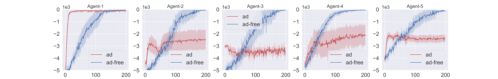
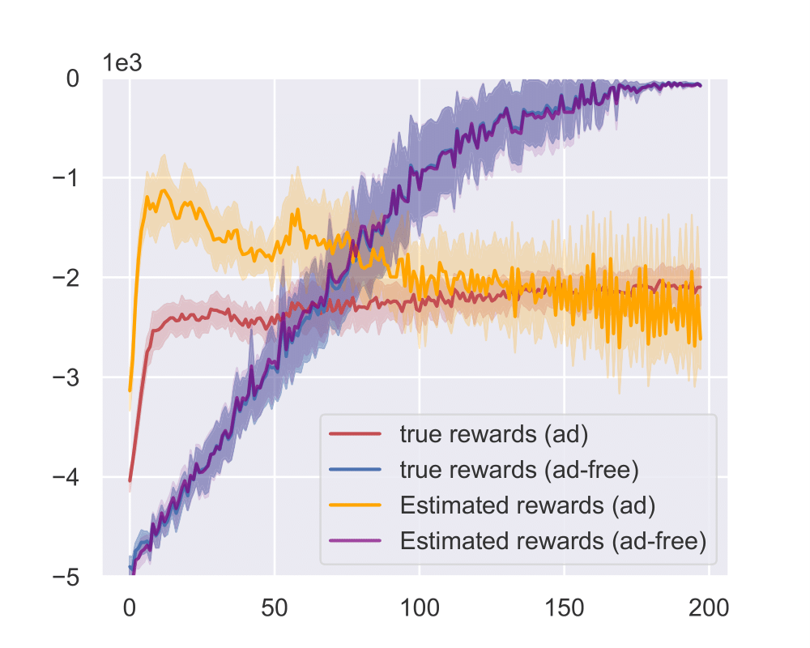

# Adversarial - Multi-Agent Reinforcement Learning (Adv-MARL)

The aim is test and implement MARL algorithms in the presence adversarial agents.

- Currently modeled a Grid_World of multi agent systems using tools from Gym.

## Multi-Agent Gridworld

